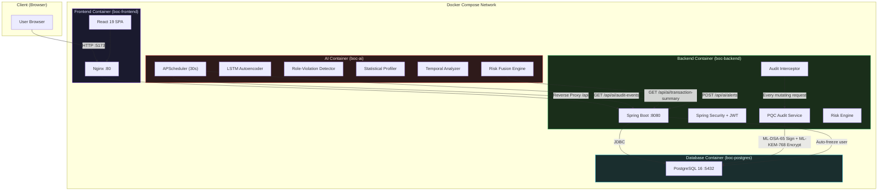
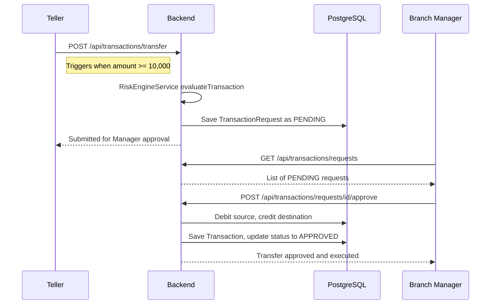
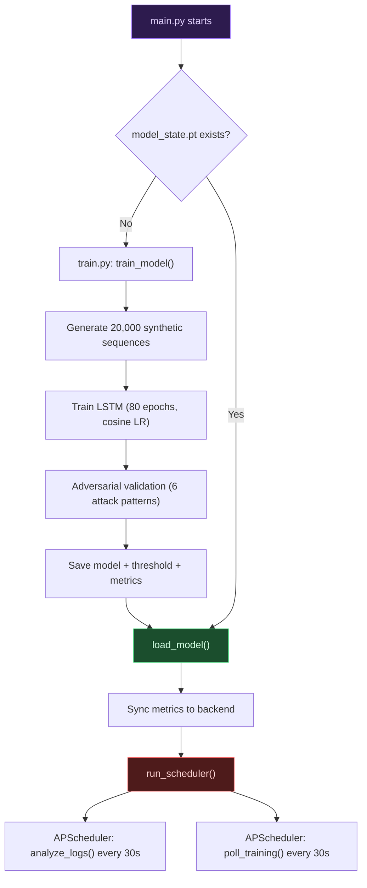
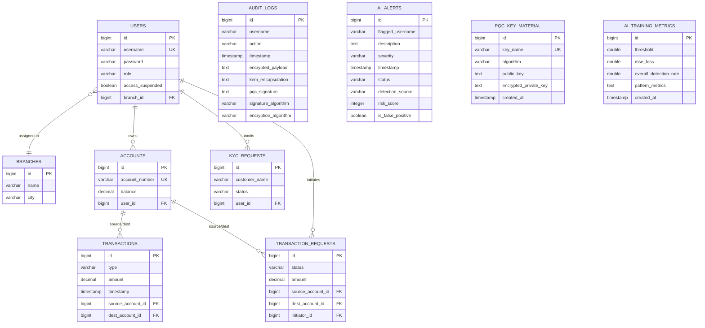
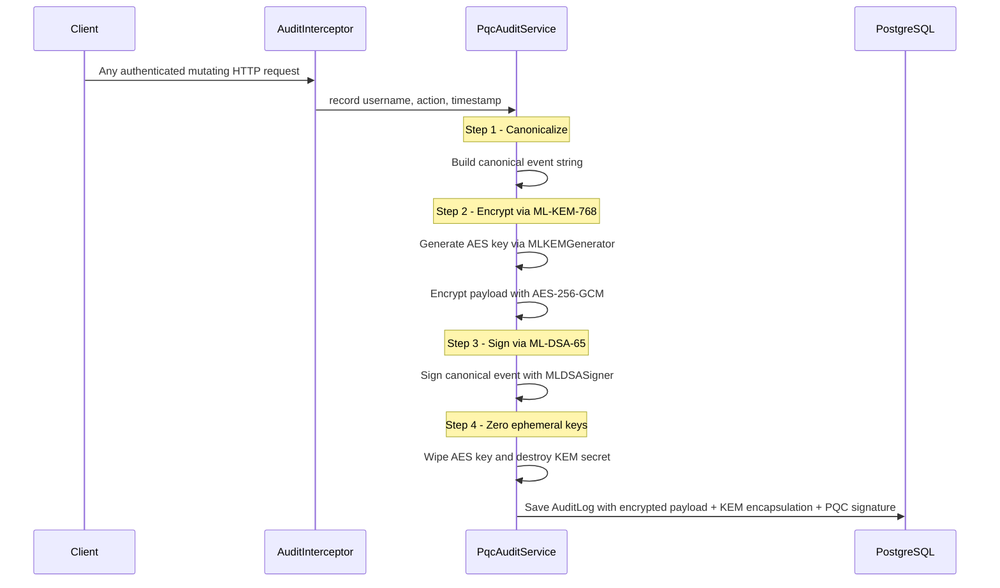
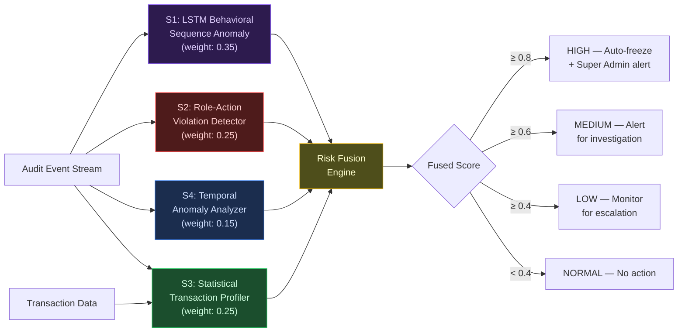
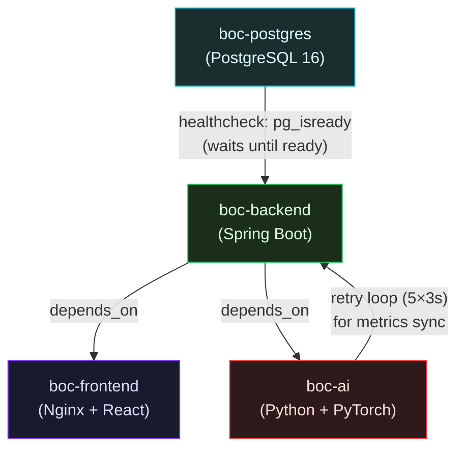
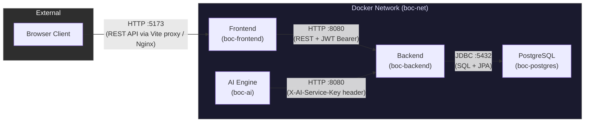

<div align="center">

# 🏦 BankOfCaptcha

### The Quantum-Resistant, AI-Self-Analysing Core Banking Platform

**Technical Documentation v3.0**

[](#backend-module)
[](#backend-module)
[](#frontend-module)
[](#ai-engine-module)
[](#database-layer)
[](#dockerization--container-orchestration)

</div>

---

## Table of Contents

1. [Introduction & Problem Statement](#1-introduction--problem-statement)
2. [System Architecture Overview](#2-system-architecture-overview)
3. [Module Deep-Dives](#3-module-deep-dives)
   - [3.1 Backend Module (Java / Spring Boot)](#31-backend-module--java--spring-boot)
   - [3.2 Frontend Module (React / Vite)](#32-frontend-module--react--vite)
   - [3.3 AI Engine Module (Python / PyTorch)](#33-ai-engine-module--python--pytorch)
   - [3.4 Database Layer (PostgreSQL)](#34-database-layer--postgresql)
4. [Post-Quantum Cryptography (PQC) Implementation](#4-post-quantum-cryptography-pqc-implementation)
5. [AI Behavioral Analysis — 4-Signal Architecture](#5-ai-behavioral-analysis--4-signal-architecture)
   - [5.1 Signal 1 — LSTM Behavioral Sequence Anomaly Detector](#51-signal-1--lstm-behavioral-sequence-anomaly-detector)
   - [5.2 Signal 2 — Role-Action Violation Detector](#52-signal-2--role-action-violation-detector)
   - [5.3 Signal 3 — Statistical Transaction Profiler](#53-signal-3--statistical-transaction-profiler)
   - [5.4 Signal 4 — Temporal Anomaly Analyzer](#54-signal-4--temporal-anomaly-analyzer)
   - [5.5 Risk Fusion Engine](#55-risk-fusion-engine)
6. [Technology Stack Rationale](#6-technology-stack-rationale)
7. [Dockerization & Container Orchestration](#7-dockerization--container-orchestration)
8. [Inter-Module Communication](#8-inter-module-communication)
9. [Project File Structure](#9-project-file-structure)
10. [Getting Started](#10-getting-started)
11. [Demo Accounts](#11-demo-accounts)

---

## 1. Introduction & Problem Statement

Modern banking infrastructure faces two converging existential threats:

1. **Insider Threats (Present Day)** — Compromised or malicious employees with privileged access can initiate fraudulent transfers, exfiltrate customer data, or tamper with audit trails. Static, rule-based detection (e.g., "flag if amount > ₹50,000") fails against sophisticated, low-and-slow attack patterns like smurfing or gradual privilege escalation.

2. **Quantum Decryption — "Q-Day" (Near Future)** — Cryptographically-relevant quantum computers will be able to break RSA-2048 and ECDSA within the decade. Nation-state adversaries are already executing "Harvest Now, Decrypt Later" (HNDL) campaigns — intercepting and storing encrypted financial data today, waiting for quantum hardware capable of retroactively decrypting it.

**BankOfCaptcha** is a next-generation core banking prototype that addresses both threats simultaneously. It unifies customer onboarding, branch operations, multi-level compliance workflows (Maker-Checker), and cryptographic audit trail protection into a single, cohesive platform. The system deploys a **4-signal PyTorch LSTM Autoencoder** for real-time behavioral anomaly detection and uses **NIST-standardized Post-Quantum Cryptographic (PQC) algorithms** to seal every audit event against future quantum attacks.

The result is a platform where:
- Every API call that mutates data is cryptographically signed and encrypted using quantum-resistant algorithms.
- Every user's behavioral pattern is continuously profiled by an AI engine that can autonomously freeze compromised accounts before a human analyst even notices.
- The entire system is containerized and deployable with a single `docker compose` command.

---

## 2. System Architecture Overview

BankOfCaptcha follows a **4-tier decoupled microservices architecture**. Each tier runs as an independent Docker container, communicating over an internal Docker network.



### The Four Tiers

| Tier | Technology | Container | Port | Responsibility |
|:---|:---|:---|:---|:---|
| **Frontend** | React 19, Vite 8, Nginx | `boc-frontend` | `5173→80` | Role-adaptive SPA serving 6 distinct user dashboards |
| **Backend** | Java 17, Spring Boot 3.2.4 | `boc-backend` | `8080` | REST API, RBAC, Maker-Checker, PQC audit sealing |
| **AI Engine** | Python 3.10, PyTorch, Pandas | `boc-ai` | — (no inbound) | Continuous behavioral monitoring, anomaly detection |
| **Database** | PostgreSQL 16 Alpine | `boc-postgres` | `5433→5432` | Persistent storage for all entities |

---

## 3. Module Deep-Dives

### 3.1 Backend Module — Java / Spring Boot

The backend is the central nervous system of BankOfCaptcha. It handles all business logic, authentication, authorization, compliance workflows, and cryptographic operations.

**Core Framework:** Spring Boot 3.2.4 on Java 17 (Eclipse Temurin)

#### Architectural Layers

```mermaid
graph LR
    subgraph Controller["Controller Layer"]
        AuthCtrl["AuthController"]
        AccCtrl["AccountController"]
        TxCtrl["TransactionController"]
        KycCtrl["KycController"]
        AuditCtrl["AuditController"]
        AdminCtrl["AdminController"]
        AlertCtrl["AiAlertController"]
        AiIntCtrl["AiIntegrationController"]
        AiTrainCtrl["AiTrainingController"]
        BranchCtrl["BranchController"]
    end

    subgraph Service["Service Layer"]
        PqcSvc["PqcAuditService"]
        AlertSvc["AlertService"]
        RiskSvc["RiskEngineService"]
        DataInit["DataInitializer"]
    end

    subgraph Security["Security Layer"]
        JwtFilter["JwtAuthenticationFilter"]
        JwtUtils["JwtUtils"]
        AuditInt["AuditInterceptor"]
        SecConfig["SecurityConfig"]
        WebConfig["WebConfig"]
    end

    subgraph Model["JPA Entity Layer"]
        User["User"]
        Account["Account"]
        Transaction["Transaction"]
        TxReq["TransactionRequest"]
        AuditLog["AuditLog"]
        AiAlert["AiAlert"]
        Branch["Branch"]
        KycReq["KycRequest"]
        PqcKey["PqcKeyMaterial"]
        AiMetrics["AiTrainingMetrics"]
    end

    subgraph Repository["Repository Layer (Spring Data JPA)"]
        Repos["10 JPA Repositories"]
    end

    Controller --> Service
    Controller --> Security
    Service --> Repository
    Repository --> Model

    style Controller fill:#1e3a5f,color:#e0f0ff,stroke:#3b82f6
    style Service fill:#1e5f3a,color:#e0fff0,stroke:#22c55e
    style Security fill:#5f3a1e,color:#fff0e0,stroke:#f59e0b
    style Model fill:#3a1e5f,color:#f0e0ff,stroke:#8b5cf6
    style Repository fill:#1e5f5f,color:#e0ffff,stroke:#06b6d4
```



#### Key Components

| Component | File | Purpose |
|:---|:---|:---|
| **PqcAuditService** | `service/PqcAuditService.java` | Core PQC cryptographic operations — signs and encrypts every audit event |
| **AuditInterceptor** | `security/AuditInterceptor.java` | Spring `HandlerInterceptor` that fires on every authenticated HTTP request |
| **RiskEngineService** | `service/RiskEngineService.java` | Real-time risk evaluation for transactions (blocks if open AI alerts exist) |
| **AlertService** | `service/AlertService.java` | Manages AI alert lifecycle: OPEN → CONTAINED → RESOLVED |
| **SecurityConfig** | `security/SecurityConfig.java` | Stateless JWT security chain, RBAC rules, CORS configuration |
| **DataInitializer** | `service/DataInitializer.java` | Seeds 6 demo users, a headquarters branch, and customer accounts on first boot |
| **AiIntegrationController** | `controller/AiIntegrationController.java` | API-key-protected endpoints exclusively for AI Engine consumption |

#### RBAC Model (6 Roles)

| Role | Spring Authority | Permissions |
|:---|:---|:---|
| Customer | `ROLE_CUSTOMER` | View accounts, balances, initiate transfers |
| Teller | `ROLE_TELLER` | Initiate transfers (branch-scoped), approve KYC, view queues |
| Branch Manager | `ROLE_BRANCH_MANAGER` | Maker-Checker approval for high-value transfers (≥₹10,000) |
| Compliance Officer | `ROLE_COMPLIANCE_OFFICER` | View + verify PQC-sealed audit logs |
| IT Admin | `ROLE_IT_ADMIN` | View audit logs, AI alerts, trigger AI retraining |
| Super Admin | `ROLE_SUPER_ADMIN` | Full access — Risk Intelligence Center, staff management, global branch operations |

#### Maker-Checker Compliance Flow



---

### 3.2 Frontend Module — React / Vite

A single-page application built with **React 19** and **Vite 8**, producing a role-adaptive dashboard that dynamically renders different panels, tabs, and capabilities based on the authenticated user's role.

#### Key Dependencies

| Package | Version | Purpose |
|:---|:---|:---|
| `react` | 19.2.7 | Core UI framework |
| `react-router-dom` | 7.18.1 | Client-side routing with protected routes |
| `recharts` | 3.9.2 | Data visualization (risk heatmaps, activity graphs) |
| `lucide-react` | 1.24.0 | Icon system |
| `react-globe.gl` | 2.38.0 | 3D globe visualization for branch operations |

#### Route Structure

| Route | Component | Access |
|:---|:---|:---|
| `/` | `Landing` | Public — marketing/overview page |
| `/login` | `Login` | Public — authentication portal |
| `/demo` | `SecurityDemo` | Public — interactive PQC verification demo |
| `/dashboard` | `DashboardRouter` | Protected — role-based dashboard dispatch |

#### Dashboard Architecture

`DashboardRouter.jsx` inspects the JWT-decoded user role and renders the appropriate dashboard:

| Role | Dashboard | Key Features |
|:---|:---|:---|
| Customer | `CustomerDashboard` | Account overview, balance display, transfer form |
| Teller | `TellerDashboard` | Transfer initiation, KYC queue management |
| Branch Manager | `BranchManagerDashboard` | Maker-Checker approval queue, branch operations |
| Compliance Officer | `ComplianceOfficerDashboard` | PQC audit log viewer with signature verification |
| IT Admin | `ItAdminDashboard` | Audit logs, AI alert monitoring, system health |
| Super Admin | `SuperAdminDashboard` | Risk Intelligence Center (heatmaps, 90-day calendars), staff management, AI model management |

#### Super Admin — Risk Intelligence Center

The Super Admin dashboard includes specialized components for threat analysis:

- **SecurityTab** — AI alert management with contain/release/resolve actions, false-positive feedback loop
- **RiskHeatmap** — Visual heatmap of user risk scores across the organization
- **RiskActivityGraph** — 90-day activity calendar with risk-level color coding
- **AlertReviewModal** — Detailed per-signal breakdown for each AI alert
- **AiModelTab** — Training metrics, adversarial validation results, trigger adaptive retraining
- **StaffManagementTab** — CRUD for staff users with role and branch assignment

#### Production Build & Serving

In Docker, the frontend is built into static assets (`npm run build`) and served by **Nginx Alpine**, with:
- SPA fallback (`try_files $uri $uri/ /index.html`)
- No-cache headers on `index.html` for instant update propagation
- Immutable caching on fingerprinted `/assets/` bundles (1 year max-age)

---

### 3.3 AI Engine Module — Python / PyTorch

The AI Engine is a **stateless, continuously polling anomaly detection service** that runs as a separate container. It does NOT receive inbound HTTP requests — instead, it pulls data from the backend on a configurable schedule (default: every 30 seconds) and pushes alerts back via the backend's API.

#### Core Files

| File | Purpose |
|:---|:---|
| `main.py` | Entry point — initializes model, starts scheduler |
| `inference.py` | LSTM architecture, all 4 signal analyzers, risk fusion engine, scheduler loop |
| `train.py` | Synthetic data generation, adversarial validation, model training pipeline |
| `config/ai_config.json` | All tunable hyperparameters — thresholds, weights, training config |
| `config/action_registry.json` | Action-to-ID mapping, risk weights, role-permission matrix |
| `traffic_generators/` | Test scripts that simulate normal and malicious traffic |

#### Startup Sequence



---

### 3.4 Database Layer — PostgreSQL

**PostgreSQL 16 Alpine** is used as the sole persistent data store. Spring Boot's JPA (`ddl-auto=update`) auto-generates and migrates the schema.

#### Entity-Relationship Model



---

## 4. Post-Quantum Cryptography (PQC) Implementation

### The Threat Model — "Harvest Now, Decrypt Later"

Nation-state actors are intercepting and archiving encrypted communications and financial data today, anticipating that future quantum computers will be able to retroactively break classical encryption (RSA, ECDSA, AES-128). Financial audit logs — which must be retained for years for regulatory compliance — are prime targets.

### Our Defense — Quantum-Proof Audit Trails (Q-PAT)

Every single API request that mutates data is intercepted by `AuditInterceptor` (a Spring `HandlerInterceptor`) and cryptographically sealed by `PqcAuditService` before being persisted to PostgreSQL.

#### Algorithms Used

| Algorithm | NIST Standard | Purpose in BankOfCaptcha | Library |
|:---|:---|:---|:---|
| **ML-DSA-65** (FIPS 204) | Module-Lattice-Based Digital Signature | Signs every audit event — provides **non-repudiation** and **tamper evidence** | Bouncy Castle 1.84 (`bcprov-jdk18on`) |
| **ML-KEM-768** (FIPS 203) | Module-Lattice-Based Key Encapsulation | Derives per-event AES-256-GCM encryption keys — provides **confidentiality** | Bouncy Castle 1.84 (`bcprov-jdk18on`) |
| **AES-256-GCM** | NIST SP 800-38D | Symmetric encryption of the audit payload using the ML-KEM-derived key | Java Cryptography Architecture (JCA) |

#### Cryptographic Flow Per Audit Event



#### Key Management

- **Key Pair Generation**: On first boot, `PqcAuditService` generates two key pairs — one ML-DSA-65 (signing) and one ML-KEM-768 (encryption) — and stores them in the `pqc_key_material` table.
- **Private Key Protection**: Private keys are encrypted at rest using AES-256-GCM with a master key derived from `PQC_MASTER_KEY` (environment variable, SHA-256 hashed to 32 bytes).
- **Production Note**: The current prototype stores encrypted private keys in PostgreSQL. Production deployments should use a Hardware Security Module (HSM) or cloud KMS.

#### Verification Flow

The Compliance Officer or IT Admin dashboard can verify any audit log entry:

1. **Decapsulate** — Use the ML-KEM-768 private key to extract the AES-256-GCM key from the stored encapsulation.
2. **Decrypt** — Decrypt the `encrypted_payload` using the recovered AES key.
3. **Verify Signature** — Use the ML-DSA-65 public key to verify the `pqc_signature` against the decrypted canonical event.
4. **Cross-check** — Compare the decrypted event against the visible metadata (`username`, `action`, `timestamp`) to detect tampering.

---

## 5. AI Behavioral Analysis — 4-Signal Architecture

BankOfCaptcha uses a **4-signal fusion architecture** for insider threat detection. Rather than relying on any single detection method, the system runs four independent anomaly detectors in parallel and fuses their outputs into a single risk score.



### 5.1 Signal 1 — LSTM Behavioral Sequence Anomaly Detector

**Weight: 0.35** | **Type: Deep Learning (Unsupervised)**

The core AI model is a **Role-Conditioned LSTM Autoencoder** (`InsiderThreatLSTM`) that learns what sequences of actions are "normal" for each user role, then flags deviations.

#### Architecture

```
Input: (action_seq: [B, T], role_id: [B])
  │
  ├─ Action Embedding: nn.Embedding(25, 16, padding_idx=0) → [B, T, 16]
  ├─ Role Embedding:   nn.Embedding(7, 8)                  → [B, 8] → broadcast → [B, T, 8]
  ├─ Positional Enc:   nn.Parameter(1, T, 4)                → broadcast → [B, T, 4]
  │
  └─ Concatenate → [B, T, 28]
       │
       ├─ Encoder LSTM (28→64, 2 layers, dropout=0.2) → hidden state
       │
       ├─ Bottleneck: top hidden → repeat T times → [B, T, 64]
       │
       ├─ Decoder LSTM (64→64, 2 layers, dropout=0.2)
       │
       └─ Linear (64→16) → Reconstructed Embeddings [B, T, 16]

Loss: MSE between reconstructed embeddings and original action embeddings
      (per-element, mask-normalized over non-padding positions)
```

**Key Design Decisions:**

1. **Role Conditioning** — The model concatenates role embeddings with action embeddings, so it learns per-role behavioral baselines. A teller performing admin actions produces high reconstruction error not because the individual actions are rare, but because they are unexpected *for a teller*.

2. **Embedding-Space Reconstruction (MSE)** — Unlike cross-entropy over a small vocabulary, MSE over continuous embeddings gives proportional error signals. An action that is "close" in embedding space to the expected action produces lower error than one that is completely unrelated.

3. **Positional Encoding** — Learnable positional parameters enable the model to detect kill-chain ordering (reconnaissance → escalation → exfiltration), where action order is as important as action identity.

#### Training Pipeline

| Parameter | Value | Source |
|:---|:---|:---|
| Synthetic Samples | 20,000 | Role-aware Markov chain generator |
| Sequence Length | 10 | `ai_config.json` |
| Epochs | 80 | Cosine LR annealing (0.001 → 0.00001) |
| Batch Size | 512 | Mini-batch with gradient clipping (max_norm=1.0) |
| Dynamic Threshold | 90th percentile of training MSE | Adaptive per-training |

#### Adversarial Validation (6 Attack Patterns)

| # | Pattern | Description | Expected Detection |
|:---|:---|:---|:---|
| 1 | Privilege Escalation | Customer performing admin actions | >95% |
| 2 | Smurfing | Rapid repeated transfers (same action) | >90% |
| 3 | Data Exfiltration | Bulk read operations | >80% |
| 4 | Cross-Role Chaos | Random actions from random roles | >85% |
| 5 | Insider Teller | Teller performing admin actions | >90% |
| 6 | Insider Manager | Manager performing financial burst | >75% |

#### Adaptive Retraining

The Super Admin can trigger adaptive retraining from the dashboard. The system:
1. Fetches all alerts marked as **false positives** from the backend.
2. Converts their action sequences into training samples.
3. Duplicates them 100× in the training set to heavily bias the model toward treating them as normal.
4. Retrains and reloads the model without service interruption.

---

### 5.2 Signal 2 — Role-Action Violation Detector

**Weight: 0.25** | **Type: Rule-Based (Config-Driven)**

An independent detector that checks whether a user's recent actions fall within the permitted action categories for their role, as defined in `action_registry.json`.

```json
{
  "role_permitted_categories": {
    "ROLE_CUSTOMER":       ["auth", "read", "financial"],
    "ROLE_TELLER":         ["auth", "read", "write", "financial"],
    "ROLE_BRANCH_MANAGER": ["auth", "read", "write", "financial"],
    "ROLE_COMPLIANCE":     ["auth", "read"],
    "ROLE_IT_ADMIN":       ["auth", "read", "admin"],
    "ROLE_SUPER_ADMIN":    ["auth", "read", "write", "financial", "admin"]
  }
}
```

**Scoring:** `score = min(1.0, (violations / total_actions) × 2.0)` — a user with 50%+ violations gets a maximum score.

**Why it's independent:** In v2 of the system, role violation was a multiplier on the LSTM error. This meant that role violations were invisible if the LSTM reconstruction error happened to be low. Making it an independent signal guarantees that a Compliance Officer attempting admin operations is always flagged, regardless of what the LSTM thinks.

---

### 5.3 Signal 3 — Statistical Transaction Profiler

**Weight: 0.25** | **Type: Statistical (Per-User Adaptive)**

The `TransactionProfiler` maintains rolling statistics per user and detects two types of financial anomalies:

#### Sub-Signal 3a — Z-Score Amount Anomaly

For each user, the profiler computes the mean and standard deviation of their historical transaction amounts. If a recent transaction exceeds a configurable Z-score threshold (default: 3.0σ), the user is flagged.

**Formula:** `z_score = (recent_max_amount - historical_mean) / historical_std`

This replaces hardcoded dollar-amount thresholds, making the system automatically adaptive to each user's transaction profile. A customer who routinely transfers ₹1,00,000 is not flagged for a ₹1,50,000 transfer, while a customer whose typical transactions are ₹500 would be flagged for ₹5,000.

#### Sub-Signal 3b — Frequency Burst Detection

Counts the number of high-risk (financial/write category) actions performed by a user in the last 5 minutes using audit logs. More than 5 high-risk actions in a 5-minute window triggers an escalating score.

**Why audit logs instead of transactions?** — Audit logs track the *initiator* of the action (the authenticated user), not the account holder. This correctly catches rogue tellers or managers who are performing rapid transfers on behalf of multiple customer accounts.

---

### 5.4 Signal 4 — Temporal Anomaly Analyzer

**Weight: 0.15** | **Type: Heuristic (Time-Based)**

Detects insider threat patterns that are invisible to the LSTM and statistical profiler:

#### Sub-Signal 4a — After-Hours Access

Flags users who perform a significant portion of their recent activity outside configurable business hours (default: 09:00–18:00). Compromised accounts or malicious insiders often operate when oversight is minimal.

**Trigger:** `after_hours_ratio > 0.3` (more than 30% of recent activity outside business hours).

#### Sub-Signal 4b — Action Diversity Spike

Compares the diversity (unique action types) of a user's last 10 actions against their historical diversity. A sudden spike suggests the reconnaissance phase of an insider attack — the attacker is exploring system capabilities they don't normally access.

**Trigger:** `recent_diversity > historical_diversity × 2.0`

---

### 5.5 Risk Fusion Engine

The fusion engine combines all four signal scores into a single risk score using configurable weights:

```
fused_score = (0.35 × S1_lstm) + (0.25 × S2_role_violation) + (0.25 × S3_statistical) + (0.15 × S4_temporal)
```

**Automatic Escalation Rule:** If ANY single signal exceeds `0.85` (configurable), the fused score is floored at `0.7` (MEDIUM severity), regardless of other signals. This prevents a critical single-signal detection from being diluted by quiet other signals.

**Alert Severity Mapping:**

| Fused Score | Severity | Action |
|:---|:---|:---|
| `≥ 0.8` | **HIGH** | Auto-freeze account, alert Super Admin |
| `≥ 0.6` | **MEDIUM** | Alert for investigation |
| `≥ 0.4` | **LOW** | Monitor for escalation |
| `< 0.4` | NORMAL | No action |

---

## 6. Technology Stack Rationale

### Why Java 17 + Spring Boot for the Backend?

> **Simulating Real Indian Banking Infrastructure**

The overwhelming majority of core banking systems in India (e.g., Finacle by Infosys, TCS BaNCS, Oracle FLEXCUBE) are built on Java. We deliberately chose Java 17 with Spring Boot to:

1. **Accurately simulate production banking environments** — Our PQC implementation demonstrates how quantum-resistant cryptography can be retrofitted into existing Java-based banking stacks using Bouncy Castle, without requiring a complete technology migration.
2. **Enterprise-grade security primitives** — Spring Security provides battle-tested authentication, authorization, and filter-chain infrastructure that maps directly to how real banks implement access control.
3. **JPA/Hibernate for relational modeling** — Banking data is inherently relational (users → accounts → transactions). Spring Data JPA provides type-safe, auditable data access.
4. **Bouncy Castle PQC compatibility** — Bouncy Castle 1.84 (`bcprov-jdk18on`) provides native Java implementations of NIST-standardized PQC algorithms (ML-DSA, ML-KEM) with the same API patterns used for classical cryptography.

### Why React 19 + Vite for the Frontend?

1. **Role-adaptive SPA** — React's component model allows us to dynamically render completely different dashboards from a single codebase based on the authenticated user's role.
2. **Vite 8** — Near-instant HMR during development, optimized production builds with content-hashed filenames for aggressive caching.
3. **Recharts** — Purpose-built for the data visualization needs of the Risk Intelligence Center (heatmaps, time-series activity graphs).

### Why Python + PyTorch for the AI Engine?

1. **PyTorch** — Provides the flexibility to implement a custom LSTM Autoencoder architecture with role conditioning, positional encoding, and embedding-space reconstruction. TensorFlow's higher-level abstractions would have constrained the architecture.
2. **Pandas/NumPy** — Essential for the Statistical Transaction Profiler and Temporal Analyzer, which operate on tabular time-series data.
3. **APScheduler** — Lightweight, in-process job scheduler for the 30-second polling loop. Avoids the operational complexity of Celery/Redis for a prototype.
4. **Stateless design** — The AI engine stores no local state beyond the model checkpoint. All behavioral data is fetched from the backend on every cycle, making it horizontally scalable and crash-resilient.

### Why PostgreSQL 16?

1. **ACID compliance** — Financial transactions demand strong consistency guarantees.
2. **TEXT columns** — PQC signatures and encrypted payloads are large Base64 strings that fit naturally into PostgreSQL TEXT columns.
3. **JPA integration** — First-class Hibernate dialect support with `ddl-auto=update` for rapid schema evolution during development.

---

## 7. Dockerization & Container Orchestration

### Container Architecture

The entire 4-tier stack is containerized using Docker Compose. Two compose files are provided:

| File | Purpose |
|:---|:---|
| `docker-compose.yml` | Database-only (for native development with hot-reload) |
| `docker-compose.full.yml` | Full stack — all 4 containers |

#### Container Specifications

| Container | Base Image | Build Strategy | Key Configuration |
|:---|:---|:---|:---|
| `boc-postgres` | `postgres:16-alpine` | Pre-built image | Health check: `pg_isready` (5s interval, 12 retries) |
| `boc-backend` | `eclipse-temurin:17-jre-alpine` | Multi-stage: Maven build → JRE runtime | Depends on: postgres (healthy) |
| `boc-frontend` | `nginx:alpine` | Multi-stage: Node 20 build → Nginx serving | Depends on: backend |
| `boc-ai` | `python:3.10-slim` | Single-stage: pip install + copy | CPU limit: 10 cores; Depends on: backend |

#### Multi-Stage Build Strategy

The backend and frontend both use **multi-stage Docker builds** to minimize image sizes:

**Backend (Java):**
```dockerfile
# Stage 1: Build with full Maven + JDK
FROM maven:3.9.6-eclipse-temurin-17 AS build
COPY pom.xml . && COPY src ./src
RUN mvn clean package -DskipTests

# Stage 2: Run with minimal JRE
FROM eclipse-temurin:17-jre-alpine
COPY --from=build /app/target/*.jar app.jar
```

**Frontend (React):**
```dockerfile
# Stage 1: Build with Node
FROM node:20-alpine AS build
RUN npm ci && npm run build

# Stage 2: Serve with Nginx
FROM nginx:alpine
COPY --from=build /app/dist /usr/share/nginx/html
```

#### Container Startup Order



#### Volume Management

| Volume | Mount Point | Purpose |
|:---|:---|:---|
| `boc_postgres_data` | `/var/lib/postgresql/data` | Persistent database storage across container restarts |
| `./ai/data` (bind mount) | `/app/data` | Persists `model_state.pt` so the AI doesn't retrain on every restart |

---

## 8. Inter-Module Communication

### Communication Matrix



### Protocol Details

| Path | Protocol | Auth Method | Data Format |
|:---|:---|:---|:---|
| Browser → Frontend | HTTP/1.1 | — | HTML/JS/CSS |
| Frontend → Backend | HTTP/1.1 REST | JWT Bearer Token | JSON |
| Backend → PostgreSQL | JDBC (TCP) | Username/Password | SQL |
| AI Engine → Backend | HTTP/1.1 REST | `X-AI-Service-Key` header | JSON |

### AI ↔ Backend Integration Endpoints

The AI Engine communicates with the backend through a **narrow, API-key-protected integration surface** (`AiIntegrationController`). These endpoints deliberately return only event metadata — never private keys or encrypted evidence.

| Endpoint | Direction | Method | Purpose |
|:---|:---|:---|:---|
| `/api/ai/audit-events` | AI → Backend | `GET` | Fetch clamped audit events (last 30 days, max 100/user) |
| `/api/ai/transaction-summary` | AI → Backend | `GET` | Fetch transaction amounts for statistical profiling |
| `/api/ai/alerts` | AI → Backend | `POST` | Submit anomaly alerts with severity and risk score |
| `/api/ai/false-positives` | AI → Backend | `GET` | Fetch false-positive-marked alerts for adaptive retraining |
| `/api/ai/training/status` | AI → Backend | `GET` | Poll for admin-triggered retraining requests |
| `/api/ai/training/metrics` | AI → Backend | `POST` | Push training analytics (MSE, detection rates) to backend |

### Security Considerations

1. **AI-Backend authentication** uses a shared secret (`AI_SERVICE_KEY`) transmitted via `X-AI-Service-Key` header — simple but sufficient for intra-network, non-public communication.
2. **The AI engine never receives PQC-sealed data** — it only sees event metadata (username, action, timestamp, role). The cryptographic evidence remains opaque to the AI, preserving separation of concerns.
3. **Clamped data fetching** — The AI engine requests at most 30 days / 100 events per user to prevent stale data pollution and limit query load on PostgreSQL.

---

## 9. Project File Structure

```
BankOfCaptcha/
│
├── docker-compose.full.yml        # Full 4-container stack deployment
├── docker-compose.yml             # Database-only (for native dev)
├── start_all.sh                   # Native startup script (bash)
├── .env                           # Environment variables (DB, PQC, AI keys)
│
├── backend/                       # ── Java 17 / Spring Boot 3.2 ──
│   ├── Dockerfile                 # Multi-stage: Maven build → JRE Alpine
│   ├── pom.xml                    # Dependencies: Spring Boot, Bouncy Castle PQC, JJWT
│   └── src/main/
│       ├── resources/
│       │   └── application.properties
│       └── java/com/bank/api/
│           ├── ApiApplication.java
│           ├── config/
│           │   ├── AppConfig.java
│           │   └── properties/
│           │       ├── AiConfigProperties.java
│           │       ├── CorsConfigProperties.java
│           │       ├── JwtConfigProperties.java
│           │       └── PqcConfigProperties.java
│           ├── controller/
│           │   ├── AccountController.java
│           │   ├── AdminController.java
│           │   ├── AiAlertController.java
│           │   ├── AiIntegrationController.java
│           │   ├── AiTrainingController.java
│           │   ├── AuditController.java
│           │   ├── AuthController.java
│           │   ├── BranchController.java
│           │   ├── KycController.java
│           │   └── TransactionController.java
│           ├── dto/
│           │   └── RiskStatDTO.java
│           ├── model/
│           │   ├── Account.java
│           │   ├── AiAlert.java
│           │   ├── AiTrainingMetrics.java
│           │   ├── AuditLog.java
│           │   ├── Branch.java
│           │   ├── KycRequest.java
│           │   ├── PqcKeyMaterial.java
│           │   ├── Transaction.java
│           │   ├── TransactionRequest.java
│           │   └── User.java
│           ├── repository/
│           │   ├── AccountRepository.java
│           │   ├── AiAlertRepository.java
│           │   ├── AiTrainingMetricsRepository.java
│           │   ├── AuditLogRepository.java
│           │   ├── BranchRepository.java
│           │   ├── KycRequestRepository.java
│           │   ├── PqcKeyMaterialRepository.java
│           │   ├── TransactionRepository.java
│           │   ├── TransactionRequestRepository.java
│           │   └── UserRepository.java
│           ├── security/
│           │   ├── AuditInterceptor.java
│           │   ├── JwtAuthenticationFilter.java
│           │   ├── JwtUtils.java
│           │   ├── SecurityConfig.java
│           │   └── WebConfig.java
│           └── service/
│               ├── AlertService.java
│               ├── DataInitializer.java
│               ├── PqcAuditService.java
│               └── RiskEngineService.java
│
├── frontend/                      # ── React 19 / Vite 8 ──
│   ├── Dockerfile                 # Multi-stage: Node build → Nginx Alpine
│   ├── nginx.conf                 # SPA fallback + asset caching rules
│   ├── package.json               # React 19, Recharts, Lucide, React-Globe
│   ├── vite.config.js
│   ├── index.html
│   └── src/
│       ├── App.jsx                # Root component with BrowserRouter
│       ├── main.jsx               # React DOM entry point
│       ├── index.css              # Global design system
│       ├── App.css
│       ├── api/
│       │   └── client.js          # Axios-like HTTP client with JWT injection
│       ├── hooks/
│       │   └── useAuth.js         # Authentication context provider
│       ├── routes/
│       │   └── ProtectedRoute.jsx # JWT guard for /dashboard
│       ├── pages/
│       │   ├── Landing.jsx / .css
│       │   ├── Login.jsx / .css
│       │   ├── SecurityDemo.jsx / .css
│       │   └── dashboards/
│       │       ├── DashboardRouter.jsx
│       │       ├── CustomerDashboard.jsx
│       │       ├── TellerDashboard.jsx
│       │       ├── BranchManagerDashboard.jsx
│       │       ├── ComplianceOfficerDashboard.jsx
│       │       ├── ItAdminDashboard.jsx
│       │       ├── AdminDashboard.jsx
│       │       └── SuperAdminDashboard.jsx
│       └── components/
│           ├── AlertReviewModal.jsx / .css
│           ├── Pagination.jsx
│           ├── RiskActivityGraph.jsx / .css
│           ├── RiskHeatmap.jsx / .css
│           ├── dashboard/
│           │   ├── AiModelTab.jsx
│           │   ├── BranchTab.jsx
│           │   ├── ComplianceTab.jsx
│           │   ├── CustomerView.jsx
│           │   ├── ManagerTab.jsx
│           │   ├── SecurityTab.jsx
│           │   ├── StaffTab.jsx
│           │   └── TellerTab.jsx
│           ├── shared/
│           └── superadmin/
│               ├── BranchOperationsTab.jsx
│               ├── SecurityTab.jsx
│               └── StaffManagementTab.jsx
│
├── ai/                            # ── Python 3.10 / PyTorch ──
│   ├── Dockerfile                 # Python 3.10 slim + CPU PyTorch
│   ├── requirements.txt           # requests, pandas, numpy, apscheduler, torch
│   ├── main.py                    # Entry point: init → train (if needed) → schedule
│   ├── inference.py               # LSTM architecture, 4 signal analyzers, fusion engine
│   ├── train.py                   # Synthetic data gen, training, adversarial validation
│   ├── config/
│   │   ├── ai_config.json         # All tunable hyperparameters
│   │   └── action_registry.json   # Action→ID mapping, risk weights, role permissions
│   ├── data/
│   │   └── model_state.pt         # Trained model checkpoint (generated at runtime)
│   └── traffic_generators/
│       ├── generate_traffic.py    # Full traffic simulator (normal + attack patterns)
│       ├── generate_teller_traffic.py
│       └── generate_manager_traffic.py
│
├── extra_docs/                    # Additional design documents
│   ├── bom_landing_page_ui_spec.md
│   ├── setup_and_run_guide.md
│   └── startup.md
│
└── manual_test_files/             # Manual QA test artifacts
```

---

## 10. Getting Started

### Option A: Full Docker Deployment (Recommended)

This method runs the complete 4-tier stack in isolated, pre-configured containers. **No Java, Node.js, or Python installation required.**

1. Ensure [Docker Desktop](https://www.docker.com/products/docker-desktop/) is installed and running.
2. Clone the repository and navigate to the root directory.
3. Run:
   ```bash
   docker compose -f docker-compose.full.yml up --build
   ```
4. Wait for the build to complete (~3–5 minutes on first run), then open:
   > 👉 **http://localhost:5173**

To stop: press `Ctrl+C` or run `docker compose -f docker-compose.full.yml down`.

### Option B: Native Development (Hot-Reload)

For active development with instant feedback:

**Prerequisites:** Java 17, Node.js 18+, Python 3.10+ (Conda environment named `FinSpark`)

1. Start the database:
   ```bash
   docker compose up -d postgres
   ```
2. Run all services:
   ```bash
   chmod +x start_all.sh
   ./start_all.sh
   ```
3. Open: 👉 **http://localhost:5173**

---

## 11. Demo Accounts

On first startup, the backend seeds the database with demo users for each role:

| Role | Username | Password |
|:---|:---|:---|
| **Customer** | `customer` | `password` |
| **Teller** | `teller` | `password` |
| **Branch Manager** | `branch_manager` | `password` |
| **Compliance Officer** | `compliance` | `password` |
| **IT Admin** | `it_admin` | `password` |
| **Super Admin** | `superadmin` | `password` |

---

<div align="center">

*Developed for the post-quantum, AI-driven future of banking.*

**BankOfCaptcha** — Where every transaction is quantum-sealed and every user is AI-profiled.

</div>
